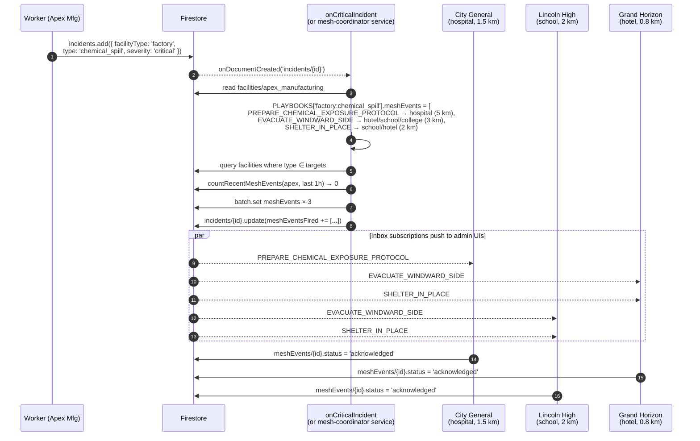

# mesh-coordinator (FLAGSHIP)

Cross-entity coordination service for SCR-Mesh. When any facility experiences a high or critical incident, the coordinator fans out contextualized mesh events to relevant nearby facilities of complementary types.

This is the novel contribution of SCR-Mesh — judges should walk away remembering this service. Built from **Prompt 3.1**.

## Architecture

| Entry point | When | Where |
|---|---|---|
| `POST /pubsub` | Production: Pub/Sub push subscription on `incident.critical` | Cloud Run |
| `POST /coordinate { incidentId }` | Manual / debug | Cloud Run (or local) |
| `onCriticalIncident` Firestore trigger | Local dev (no Pub/Sub emulator) | `firebase/functions/src/mesh/onCriticalIncident.ts` |

The Firestore trigger inlines the same algorithm as the service so the local emulator demonstrates the chain end-to-end without requiring a Pub/Sub emulator.

## Algorithm

1. Resolve incident + source facility.
2. Skip if severity ∉ {high, critical}.
3. Look up `PLAYBOOKS["{facilityType}:{incidentType}"].meshEvents`.
4. Merge in any UPPER_SNAKE_CASE event types Gemini emitted in `incident.aiSummary.meshEventRecommendations`.
5. For each rule:
   - Query candidate facilities by target types.
   - Drop the source facility.
   - Filter by haversine distance ≤ `radiusKm`.
   - Honor opt-in mesh subscriptions when present (`meshSubscriptions` collection).
6. Apply rate limit: max **10 outbound mesh events / hour** per source facility.
7. Batch-write `meshEvents` docs (status: `published`).
8. Update incident with the new mesh event IDs.

## Sequence diagram — factory chemical_spill



## Local development

```bash
# unit tests (6 cases — covers playbook lookup, radius, severity gate,
# subscriptions, AI recommendations, rate limit)
pnpm --filter mesh-coordinator test

# run HTTP server for /pubsub or /coordinate testing
pnpm --filter mesh-coordinator dev

# end-to-end through the firestore emulator
# 1. Start emulators from repo root:
#    pnpm exec firebase emulators:start --only functions,firestore,auth
# 2. Create a critical incident in Firestore Emulator UI
# 3. Watch firebase functions logs:
#    [mesh] published N mesh events for {incidentId}
```

## Deployment notes (Phase 7)

- Container: `Dockerfile` (Node 20 alpine, multi-stage build).
- Cloud Run: min instances 0 OK; coordinator is event-driven.
- Pub/Sub topic: `incident.critical` (push subscription → `https://<service>/pubsub`).
- Pub/Sub topic: `mesh.event.created` — published by the service to wake downstream notification fanouts (wire when notification service exists).
- IAM: `roles/datastore.user` for Firestore + `roles/pubsub.publisher` for outbound topic.
